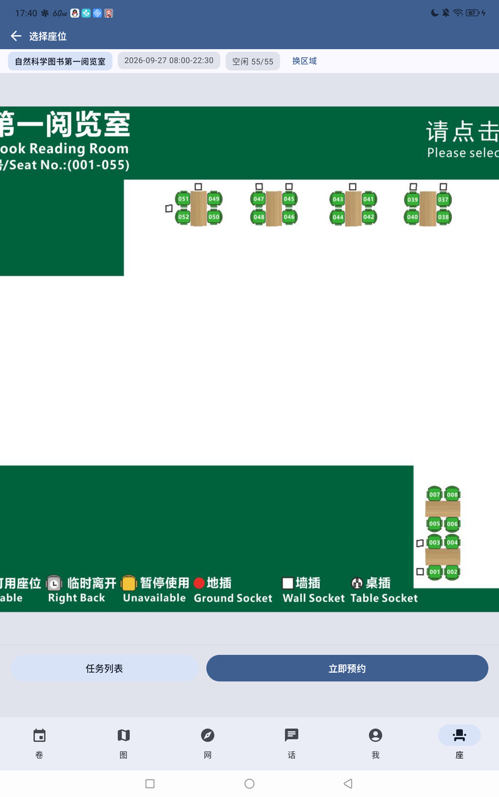
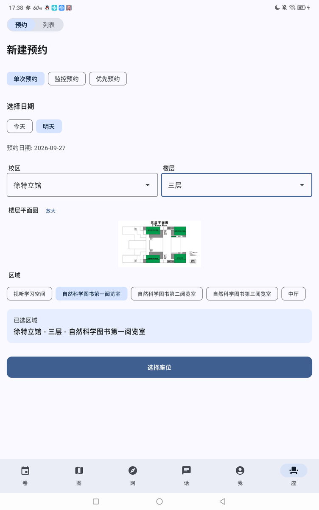
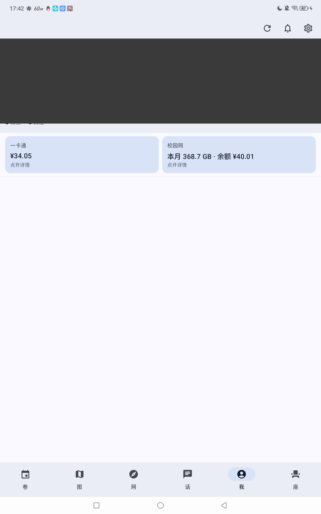
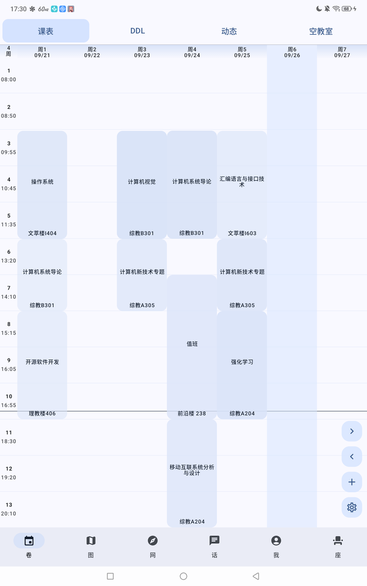
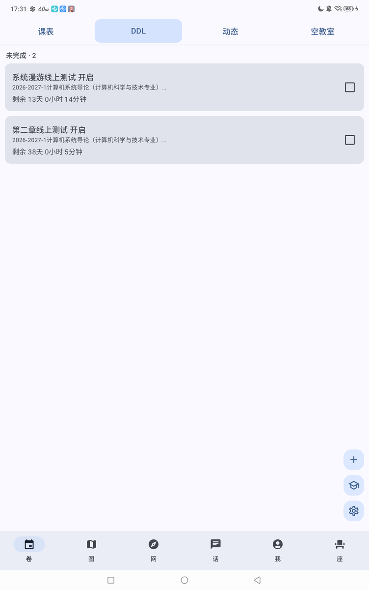
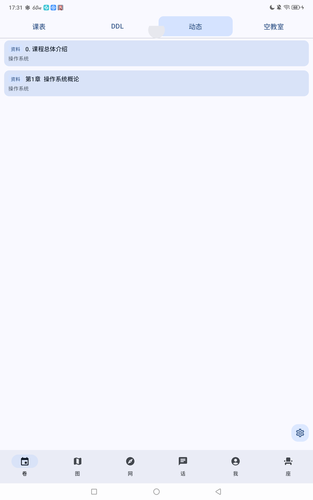
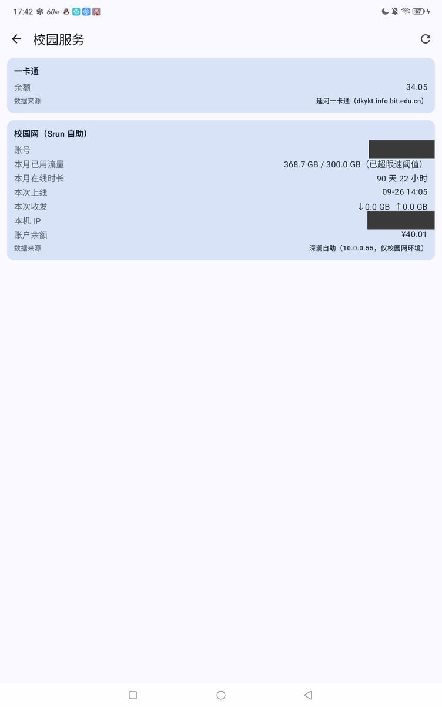
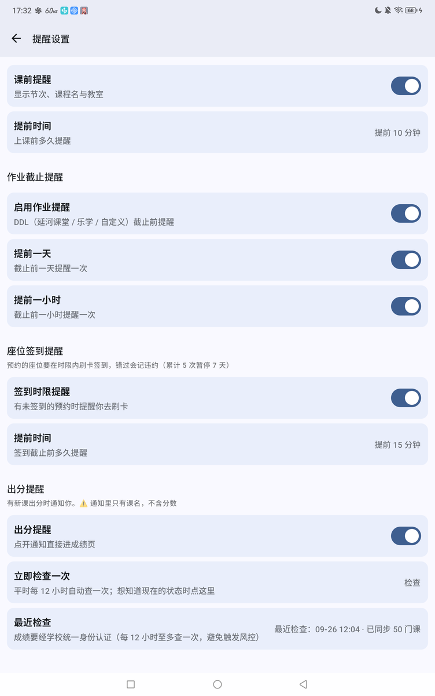

# BIT101-S

> 在 [BIT101-Android](https://github.com/BIT101-dev/BIT101-Android) 之上扩展的北理工校园助手：
> 多了**座位预约**、**桌面小组件**、**提醒中心**、**校园服务（一卡通 / 校园网）**，并修掉了原版若干实际不可用的功能。

---

## ✨ 亮点速览（与原版的差异）

1. 🪑 **座位预约全流程** —— 选校区/楼层/区域/日期，在**服务端真实房间底图**上点选座位，三种模式（单次 / 监控 / 优先），后台保活抢座，抢到即通知。
2. 📊 **桌面小组件（4 页）** —— 课程 / DDL / 动态 / 座位 一处切换，**可滚动列表**，点条目**直接跳进 App 对应页面**（原版没有组件）。
3. 🔔 **提醒中心（5 类）** —— 上课 / 作业截止 / 座位签到时限 / **出分** / **网费不足 + 流量超限**，每类可开关、可设提前量，到点**二次校验**，不会发过期提醒。
4. 💳 **校园服务（原生页面）** —— 一卡通余额 + 校园网**本月流量 / 在线时长 / 账户余额**，一屏看完，**不跳网页**；未在认证页登录时给「去认证」按钮。
5. 🚦 **校园网流量防护** —— 本月用量到 **270 GB / 300 GB（限速阈值）** 各提醒一次，详情页直接显示 `368.7 GB / 300 GB（已超限速阈值）`。
6. 📚 **DDL 换源到延河课堂** —— 作业自动同步进 DDL 列表并**保留手动勾掉的完成状态**；乐学退居设置页里的备选入口。
7. 🗂 **手动改课表（覆盖层）** —— 改教室 / 改时间 / 隐藏课程写在**独立覆盖层**，原始课表数据不受影响，同步课表不会覆盖你的修改。
8. 🧠 **出分提醒真的能响**（原版是坏的）—— 原 `GET /scores` 已 404，这里跟进到**异步认证流程**，并把成绩页做成通知直链。
9. 🔐 **登录健壮性** —— 学校域名（`*.bit.edu.cn`）一律留在 App 内 WebView（修掉「CAS 登录被踢去外部浏览器 → 登录白登」）；短信二次验证直接复用 BIT-Login SDK。
10. 🧪 **432 条单测全绿** —— 纯逻辑一律抽 `*Logic`；构建前置阿里云镜像（原来直连大 jar 仅 ~14 KB/s，会卡死）。
11. 🛡 **隐私边界** —— 出分通知**只有课名、不含分数**（用户明确要求，单测锁死）。

---

## 📷 界面预览

> 真机（Android 13）实拍。**头像 / 昵称 / UID / 学号 / IP 已打码**。

<p align="center">
  
  
  
</p>
<p align="center"><sub><b>座位预约</b>：真实房间底图点选（空闲数 + 图例） · <b>新建预约</b>：校区/楼层/区域/日期/模式 · <b>「我」页</b>：校园服务两张卡常显摘要</sub></p>

<p align="center">
  
  
  
</p>
<p align="center"><sub><b>课表</b>（tab 顺序 课表/DDL/动态/空教室） · <b>DDL</b>（未完成 / 已完成两栏，点条目切换） · <b>动态</b>（延河课堂）</sub></p>

<p align="center">
  
  
</p>
<p align="center"><sub><b>校园服务详情</b>：一卡通余额 + 校园网本月流量（`368.7 GB / 300.0 GB（已超限速阈值）`）/时长/余额 · <b>提醒设置</b>：五类提醒 + 出分「最近检查 / 立即检查一次」</sub></p>

<p align="center">
  
</p>
<p align="center"><sub><b>桌面小组件</b>：课程（当天完整行程）· DDL（未完成 / 已完成）· 动态 · 座位 四页一键切换，内容可上下滚动</sub></p>

---

## 全部功能一览（每条一句话）

### 一、相对原版**新增**的功能

| 功能 | 一句话 |
|---|---|
| 座位预约 | 在真实房间底图上点选座位预约，支持**单次 / 监控 / 优先**三种模式 |
| 后台抢座 | 前台服务持续轮询，锁屏 / 退后台 / 进程重启都能续跑，抢到即发通知 |
| 我的预约 | 签到时限倒计时、一键取消、历史任务（进行中 / 已结束）查看 |
| 桌面小组件 | 课程（全天行程，含空档）/ DDL / 动态 / 座位 四页，可滚动、点条目跳进 App |
| 提醒中心 | 上课、DDL、座位签到、出分、网费+流量 五类提醒，可开关、可设提前量 |
| 校园服务 | 一卡通余额 + 校园网本月流量·在线时长·本次上线·IP·余额，原生展示 |
| 校园网去认证 | 未在校园网认证时，详情页给「去认证」并在 App 内打开认证门户 |
| 延河课堂 DDL | 作业自动同步进 DDL（保留完成状态），可随时手动重新拉取 |
| 课程动态 | 延河课堂的作业 / 资料 / 公告聚合，支持按类型过滤与条数上限 |
| 手动改课表 | 覆盖层方式改教室 / 时间 / 隐藏课程，不动原始课表数据 |
| 手动日程 | 自定义 DDL 与日程，与延河课堂来源并存 |
| 成绩页 | 通知直链到成绩查询页（学号密码自动填好） |

### 二、原版已有、我们**改过**的部分

| 项 | 改动 |
|---|---|
| 底部页签 | 新增「座」，共 **6 页**：卷 / 图 / 网 / 话 / 我 / 座 |
| 课表页 tab 顺序 | 改为 **课表 / DDL / 动态 / 空教室**（动态挪到 DDL 旁边） |
| 桌面小组件页序 | **课程 / DDL / 动态 / 座位**，页号改存**页名**（重排不会静默错页） |
| 成绩 | 从「点开落到 Web 首页」改为**直达成绩页**；接口迁移到异步认证流程 |
| 登录 / 会话 | 学校域名留 WebView；失败分类（网络抖动 vs 认证失败）不再误清登录态 |
| 校园网卡 | 三种状态分开显示：正常 / 本机未认证 / 连不上（原来一律「需连接校园网」） |
| 构建 | `settings.gradle` 前置阿里云镜像；`:app` 编译从「卡 50 分钟」到几分钟 |

### 三、原版功能（保持原样或仅小修）

卷（课表）/ 图（地图）/ 网（BIT101 Web）/ 话（话廊）/ 我（个人页）、帖子与评论、
图片上传、账号与外观设置、版本更新检查等。

---

## 与原版逐项差异

| 维度 | BIT101-Android | BIT101-S（本仓库） |
|------|---------------|-------------------|
| 底部页签 | 5 个：卷、图、网、话、我 | **+1 个「座」**（座位预约） |
| 桌面小组件 | 无 | `features/widget`：4 页可切换、可滚动、点条目跳 App |
| 提醒 | 无 | `features/notify`：5 类提醒 + WorkManager 排期 + 去重 |
| 校园服务 | 无 | 一卡通余额、校园网流量/时长/余额（原生页面） |
| 座位 API 认证 | 无 | OkHttp + Bearer JWT，JWT 来自 seatlib 的 phpCAS 会话 |
| 会话持久化 | — | JWT 加密落盘，冷启动免重登 |
| 后台任务 | — | 前台服务（`dataSync`）轮询，可跨重启续跑 |
| 座位图 | — | 服务端真实底图 + 百分比坐标热区，双指缩放 |
| DDL 数据源 | 乐学 | **延河课堂（eclass）为主源**，乐学保留为备选 |
| 成绩接口 | `GET /scores`（**实测 404，功能不可用**） | 认证主机异步挑战流程（可用） |
| 单测 | 少量 | **432 条**（座位 145 / 数据 136 / 组件 69 / 提醒 40 / 设置 36 / 课表 6） |

---

## 使用方式

1. 打开 App，在 **「卷」** 页用学号 + 密码登录（完成学校统一身份认证）
2. 底部 **「座」** 页做座位预约：

| 页面 | 功能 |
|------|------|
| **预约** | 选校区→楼层→区域、日期，在真实房间底图上点选座位 |
| **列表** | 管理「我的预约」（签到时限 / 取消）与后台预约任务（进行中 / 已结束） |

三种预约模式：

| 模式 | 说明 |
|------|------|
| 单次预约 | 在座位图上点选一个座位，立即预约 |
| 监控预约 | 盯住图上点选的一个座位，空出后自动预约 |
| 优先预约 | 图上多选若干个座位并按优先级排队（也可「不限」），空出即抢 |

> 监控与优先都在**座位图上点选**，不需要手输座位号 —— 服务端座位号是补零字符串
> （`"001"`），手输极易不匹配。

3. **「我」** 页 → 校园服务卡：看一卡通余额与校园网用量，点开进详情页（未登录时点「登录一卡通」）
4. 桌面长按 → 添加小组件 → **BIT101**；组件内左右/点击页签切换 4 页
5. 设置 → **提醒设置**：五类提醒的开关与提前量；出分组里还有「最近检查」状态与「立即检查一次」

---

## 关键链路与结论（踩过的坑都在这里）

### 座位：两套彼此独立的会话

BIT101 的学校会话与 seatlib 的 phpCAS 会话**不互通**（Cookie 与域名都不同），
所以「复用学校 Cookie 直接访问座位接口」行不通：

```
BIT101 登录（学校统一身份认证，BIT-Login SDK）
    ↓ 尝试静默换取 POST seatlib.bit.edu.cn/api/cas/user
    ├─ 成功 → 拿到 JWT（Authorization: bearer{token}）
    └─ 失败 → App 内 WebView 完成 phpCAS 登录
                 ↓ 拦截含 cas= / ticket= 的 URL 取 ticket
                 ↓ 同步 WebView cookie 到 OkHttp cookie store
                 ↓ POST /api/cas/user（带 ticket）换 JWT
```

要点：**必须在 App 内 WebView 完成 CAS**（外部浏览器的 cookie OkHttp 读不到）；
学校域名一律留 WebView；SSO 前置脚本要求布局完成后再 `loadUrl`（`innerHeight = 0` 时会抛错）。
完整服务端契约见 **[docs/seatlib-contract.md](docs/seatlib-contract.md)**。

### 校园服务：三条链路

| 数据 | 链路要点 |
|---|---|
| 一卡通余额 | 学校 CAS（`dkykt.info.bit.edu.cn`）；**登录判定只看重定向后的最终 URL**，不看 HTML 关键词（首页正文含「统一身份认证」文案，按关键词判会把已登录误判成未登录） |
| 校园网 | 深澜 Srun 自助接口 `10.0.0.55/cgi-bin/rad_user_info`，**免登录**但**仅校园网内可达**；`[6]` 本月流量、`[7]` 本月在线时长（按设备计时，多设备会各记一份）、`[11]` 余额 |
| 成绩 | BIT101 **认证主机** `login.bit101.flwfdd.xyz` 的异步挑战流程：起挑战 → 轮询 `/api/auth/{id}` → 带 Bearer 取二维表（第 0 行表头） |

⚠️ 校园网限额：**300 GB 后限速**，270 GB 与 300 GB 各提醒一次（硬编码，套餐固定）。

### 提醒：WorkManager 一次性任务 + 每日重排

五类提醒各自「排期 → 到点发 → 二次校验 → 去重」；去重键就是任务唯一名。
座位签到提醒与上课提醒**方向相反**（发现得晚也必须立刻补发）。
出分与网费检查走「App 前台取到数据时立即判 + 每日兜底」，因为这两个数据源只有校内可达。
设计细节见 **[docs/notify.md](docs/notify.md)**。

### 桌面小组件：RemoteViews，不用 Glance

组件用传统 `AppWidgetProvider` + `RemoteViews` + `ListView`(RemoteViewsService)：
内容区要滚动只能用 collection 机制；`Glance.update()` 对已存在的 Session 不保证重跑渲染，
会出现「状态写了但画面不变」。三坑（只能 LinearLayout 系 / PendingIntent `data` 必须唯一 /
`setOnClickFillInIntent` 是覆盖语义）与验证清单见 **[docs/widget.md](docs/widget.md)**。

### 座位图渲染（改动前必读）

`/api/seat/map` 返回的五张图（free/book/close/leave/use）**不是互补图层，而是五张各自完整的房间图**。
必须**每个座位按自身状态挑一张图、只显示那一块**，绝不能叠加；实现上按状态去重最多加载 5 张位图，
在一个 `Canvas` 上用 `drawImage` 的 `srcOffset`/`srcSize` 裁剪。
验收标准是**逐像素差分**（实测平均差 0.0211，与官方前端渲染一致）。

---

## 模块结构

```
features/seat/                 # 座位预约（原版没有）
├── api/                       # SeatHttp / SeatCookieJar（WebView↔OkHttp cookie 桥）/
│                              #   SeatApi / SeatResponseParser / SeatSession（CAS 换 JWT）/
│                              #   SeatTaskRepository（任务状态唯一持有者）
├── model/                     # 座位、时段、任务、我的预约、区域树
├── ui/                        # SeatMapCanvas（底图+热区+缩放）、列表、登录页
├── SeatViewModel.kt           # 状态管理，不执行轮询
├── SeatMonitorService.kt      # 前台服务：实际轮询与结果通知（唯一执行者）
└── SeatStatusLogic.kt         # App 与组件共用的纯逻辑

features/notify/               # 提醒中心（原版没有）
├── NotifyLogic.kt             # 全部纯逻辑：提醒时刻/窗口/去重键
├── NotifyScheduler.kt         # 排期：每条提醒一个一次性任务 + 每日重排
├── NotifyFireWorker.kt        # 到点发通知（执行前二次校验）
├── NetFeeCheckWorker.kt       # 网费不足 + 流量阈值（270/300 GB）
├── ScoreNotifyChecker.kt      # 出分：拉成绩 → 差分 → 通知（只报课名）
└── NotifyCenter.kt            # 渠道与文案的唯一出口

features/widget/               # 桌面小组件（原版没有）
├── WidgetLogic.kt             # 周次/节次/全天行程/空闲合并等纯逻辑
├── WidgetViews.kt             # WidgetData → RemoteViews（页签/条目/日期栏/PendingIntent）
├── WidgetListService.kt       # 可滚动列表的数据源（RemoteViewsService）
├── WidgetPageStore.kt         # 每个实例的当前页（存**页名**，重排不错页）
└── BIT101WidgetProvider.kt    # onUpdate / 点击广播 / 渲染

features/user/ ...             # 校园服务详情页（CampusServiceScreen + 共用 VM）

data/school/                   # 校园数据纯逻辑：CampusCardLogic（一卡通）/
                               #   CampusNetLogic（校园网 + 限额常量）/ CampusNetResult（三态）
data/score/                    # 成绩：ScoreLogic（解析/差分/文案）+ ScoreQueryLogic（轮询与限频）
api/                           # Retrofit 服务 + BIT-Login SDK 封装
api/src/probe/                 # 调试探针（独立源码集，**不进发布包**）
```

⚠️ 依赖方向刻意设计：`notify` 不依赖 `seat`/`widget`（反向由 seat 调用 notify）；
`widget` 不依赖 `seat`（座位快照由 `SeatWidgetPublisher` 单向 push）。
详见各界面的 KDoc 与 `docs/`。

---

## 构建

```bash
cd BIT101-seat
./gradlew.bat :app:assembleRelease     # 发布包：app/build/outputs/apk/release/
./gradlew.bat :features:seat:testDebugUnitTest   # 单测（可换任意模块）

# 一卡通/校园网调试探针（凭据走 -P 参数，不落盘）
./gradlew.bat :api:runProbe "-Psid=<学号>" "-Ppwd=<密码>"
```

⚠️ `settings.gradle` 已**前置阿里云镜像** —— 直连 Maven Central 的大 jar 只有 ~14 KB/s，
会让构建挂在下载上几十分钟；代理也不稳定（小文件走代理反而更慢）。
环境相关细节（Gradle 缓存损坏、写盘被吞等）见 [DEVELOPMENT.md](DEVELOPMENT.md)。

---

## 测试状态

| 模块 | 用例数 | 状态 |
|------|-------|------|
| `features:seat` | 145 | ✅ |
| `data` | 136 | ✅ |
| `features:widget` | 69 | ✅ |
| `features:notify` | 40 | ✅ |
| `features:setting` | 36 | ✅ |
| `features:schedule` | 6 | ✅ |
| **合计** | **432** | ✅ 全绿 |

真机实测记录（最新）：
- 一卡通余额、校园网「本月已用流量 / 在线时长 / 余额」原生显示 ✅
- 流量提醒：装包后立即收到「校园网流量已超限速阈值」，且重复触发**不会重复提醒** ✅
- 出分链路：设置 → 提醒 → 立即检查 → 「已同步 50 门课」✅
- 座位图与官网一致性：逐像素差分平均差 0.0211 ✅

### 已知限制

- **学校 SSO 短时间多次登录会触发二次验证**（短信 / 邮件 / 扫码），且 seatlib 是**单会话**系统，
  同账号在别处登录立即互踢。联调时不要让 App 与脚本同时登录。
- **校园网数据只有校园网内可达**（`10.0.0.55` 是内网地址）——校外显示「不在校园网」属正常。
- **一卡通流水拿不到**：学校把该功能限定在**钉钉客户端**内（菜单接口直接返回
  「请使用钉钉客户端访问」），Web/App 侧无等价入口。
- **成绩检查每 12 小时至多一次**：每次检查=一次学校登录，限频是**防封号**的必要手段
  （设置页有「立即检查一次」可手动触发）。
- **seatlib 的 TLS 证书链不完整**（服务端只发叶证书）——这是服务端配置缺陷，建议向学校反馈；
  客户端已内置兜底证书（仅对 seatlib 生效）。
- Android 15 对 `dataSync` 前台服务有 6 小时/天上限；持续轮询 2 小时耗电明显（「能抢到座」的代价）。
- 部分厂商系统（如 ZTE/nubia）会**压制第三方应用 logcat** —— 调试请读界面而非日志。

---

## 发布与分支

- `master` = 可发布状态；**版本号只在发布时改**（根 `build.gradle` 的 versions 块），
  每次发布打 tag（当前 `v1.9.10`），发布包放仓库上层目录 `BIT101-S-v<x.y.z>-release.apk`。
- 较大功能按分支开发（`feature/widget`、`feature/schedule-edit` 等），完成后合回 `master`；
  座位模块的既有约定沿用：纯逻辑抽 `*Logic`、`testDebugUnitTest` 必须全绿。
- 各分支的可行性评估与执行顺序见 **[docs/upstream-feature-plan.md](docs/upstream-feature-plan.md)**。

---

## 相关文档

| 文档 | 内容 |
|---|---|
| [docs/seatlib-contract.md](docs/seatlib-contract.md) | **seatlib 服务端契约**与关键发现（时段 id / 取消参数 / 单会话 / TLS 缺陷） |
| [docs/widget.md](docs/widget.md) | **桌面小组件**设计、RemoteViews 三坑、Glance 陷阱、验证清单 |
| [docs/notify.md](docs/notify.md) | **提醒中心**设计与验证记录 |
| [docs/ddl-source-contract.md](docs/ddl-source-contract.md) | **DDL 数据源**（延河课堂）契约 |
| [docs/course-overlay.md](docs/course-overlay.md) | **手动改课表**的覆盖层方案 |
| [docs/codebase-survey.md](docs/codebase-survey.md) | 代码库勘察与模块划分 |
| [docs/next-round-plan.md](docs/next-round-plan.md) | **当前待办与规划**（含已关闭项与理由） |
| [docs/upstream-feature-plan.md](docs/upstream-feature-plan.md) | 上游设想梳理与分支规划 |
| [CHANGES.md](CHANGES.md) | 逐版本变更记录 |
| [ROADMAP.md](ROADMAP.md) | 路线图与真机验证清单 |
| [DEVELOPMENT.md](DEVELOPMENT.md) | 开发环境与构建细节 |
